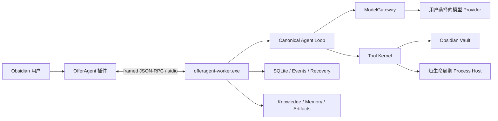

# OfferAgent

> 一个面向 Obsidian 的 Windows 本地 AI Agent：把对话、文档理解、知识组织和可审批的文件操作放在同一个可恢复运行时中。

[](https://www.microsoft.com/windows/)
[](https://www.python.org/)
[](https://obsidian.md/)
[](https://github.com/ljrkkaa/OfferAgent/actions/workflows/windows-local-runtime.yml)
[](LICENSE)

OfferAgent 是一个 **local-first、Obsidian-native、provider-neutral** 的个人 Agent 工程。它不需要常驻服务器：Obsidian 插件直接启动本地 Worker，由单一 Agent Loop 管理模型调用、工具执行、权限审批、知识库、记忆、事件与崩溃恢复。

> [!IMPORTANT]
> 项目目前处于 pre-alpha，仅面向个人 Windows x64 本地构建。尚不提供签名安装包、自动更新、ARM64 构建或多用户服务端。

## 为什么是 OfferAgent

| 目标 | 实现方式 |
| --- | --- |
| 本地优先 | Vault、SQLite、会话和派生产物由本地 Worker 持有 |
| 单一执行边界 | 每个插件实例对应一个 Worker 和一个 canonical Agent Loop |
| 显式安全边界 | 文件写入、Shell 和其他副作用统一经过策略、审批、审计和事务 |
| 可恢复 | Session、Run、事件、工具日志和本地状态支持断线与崩溃后收敛 |
| 有依据的知识 | 文档解析、语义 PageIndex、引用校验和 Wiki 编译保留来源链路 |
| 模型与工具解耦 | 模型只通过 `ModelGateway` 参与推理，不直接持有 Vault、Session 或工具 |

## 架构概览



- 插件与 Worker 之间的唯一 IPC 是继承的 stdin/stdout。
- 同一 Windows 用户和会话中，同一 canonical Vault 只允许一个 Worker 持有写入边界。
- Shell 和 Hook 由短生命周 Process Host 执行，并受进程目录、hash、Job Object 和策略约束。
- 除用户显式选择的模型 Provider 外，Runtime 不需要业务网络出口。

## 核心能力

- **Agent Loop**：结构化规划、预算、取消、上下文压缩与终止判定。
- **文档理解**：支持 PDF、PNG、JPEG 和 WebP；PDF 优先提取内嵌文本，无文本页再进入 OCR。
- **知识管道**：源发现、结构化页索引、引用验证、增量 Wiki 和语义检索。
- **个人记忆**：来源绑定的持久记忆、可审计准备与检索工具。
- **权限与审批**：风险分级、授权绑定、执行前复核和可恢复事务。
- **Subagent**：受预算、取消、工具范围和父子运行边界约束的子任务。
- **可观测性**：结构化事件、诊断、指标和敏感字段脱敏。

## 仓库结构

```text
packages/offeragent-harness/   Python Agent Core、Worker、协议、工具与构建脚本
src/interface/obsidian/        Obsidian 插件源码与本地 Runtime 客户端
evaluation/                    可复现的评测脚本与非敏感配置
.github/workflows/             Windows CI 质量门禁
```

## 开发环境

建议配置：

- Windows 10/11 x64
- Python 3.12 和 [`uv`](https://docs.astral.sh/uv/)
- Node.js 20、Corepack 和 Yarn 1.22
- Obsidian 1.6+
- `rg.exe`（本地插件构建时固定写入 Runtime）
- 需要图片 OCR 时：NVIDIA CUDA/cuDNN 及可用的 ONNX Runtime CUDA Provider

### Harness

```powershell
cd packages/offeragent-harness
uv sync --extra dev --locked --python 3.12
uv run pytest -q
uv run ruff check src tests scripts
uv run mypy src tests
uv build
```

### Obsidian 插件

```powershell
cd src/interface/obsidian
corepack enable
corepack yarn install --frozen-lockfile
corepack yarn protocol:check
corepack yarn test
corepack yarn typecheck
```

## 构建本地插件

完整本地插件由 Harness 的构建脚本生成，不直接提交 `main.js`、Worker 二进制文件或构建目录。

```powershell
cd packages/offeragent-harness
uv run python scripts/build_local_windows_plugin.py `
  --output ..\..\..\artifacts\offeragent-obsidian-plugin `
  --ripgrep-executable C:\path\to\rg.exe
```

更新已有 Vault 前，请先停止 Runtime 并完全退出 Obsidian：

```powershell
uv run python scripts/update_local_windows_plugin.py `
  --vault-root 'C:\path\to\your-vault' `
  --ripgrep-executable C:\path\to\rg.exe
```

## 质量门禁

GitHub Actions 会在 Windows 上验证：

- 仓库生产闭包和禁止依赖
- 架构依赖方向与协议生成物
- Ruff、Mypy 和 Python 测试
- Obsidian 协议一致性、Node 测试和 TypeScript 类型检查
- Python 包构建

本仓库不提交本地测试结果、冻结基线、知识库内容、密钥或构建产物；结果以当次 CI 的实时退出状态为准。

## 安全说明

- 附件和 Vault 内容始终视为不可信输入。
- 写入 Vault 必须通过差异、策略、审批和原子提交闭环。
- 模型 Provider 不直接获得文件系统或进程执行权。
- 仓库不应包含 `.env`、访问令牌、真实履历/面试材料、本地知识库或评测产物。

如果发现真实凭据曾进入 Git 历史，请先立即轮换凭据，再清理历史；单纯删除工作区文件不能消除历史泄露。

## License

仓库根目录代码按 [GNU Affero General Public License v3.0 or later](LICENSE) 提供。
